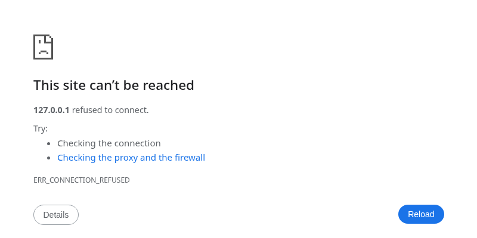

# Example

Browser-targeted tests that exercise the `syscall/js` package to read DOM properties from `window`.

## Files

```
example/
├── go.mod            # Module definition
└── window_test.go    # TestWindow: asserts viewport dimensions via js.Global
```

The test file uses `//go:build wasm` so it only compiles when targeting `GOOS=js GOARCH=wasm`. On the host platform `go test` skips it entirely.

## Running with gotestwasm

Build the WASM test binary:

```
gotestwasm -tags=wasm ./example
```

Build and run in headless Chromium:

```
gotestwasm -run -tags=wasm ./example
```

Expected output:

```
=== RUN   TestWindow
    window_test.go:19: window innerWidth=1280, innerHeight=1024
--- PASS: TestWindow (0.00s)
PASS
```



If the viewport is too small the test fails with a descriptive error:

```
=== RUN   TestWindow
    window_test.go:19: window innerWidth=800, innerHeight=600
    window_test.go:21: expected window.innerWidth > 1024, got 800
    window_test.go:25: expected window.innerHeight > 768, got 600
--- FAIL: TestWindow (0.00s)
FAIL
```

Adjust the Chromium viewport with the `--window-size` flag if needed:

```
gotestwasm -run -tags=wasm ./example -- --window-size=1920,1080
```

## What the test does

The test calls `js.Global().Get("window")` to access the browser's `window` object, then reads `innerWidth` and `innerHeight`. It asserts the viewport is at least 1024x768, which is the default size `gotestwasm` configures Chromium with. In a real browser with the WASM loaded, these values come from the actual browser window — making this pattern useful for testing code that interacts with DOM layout, `canvas` sizing, or responsive breakpoints.
